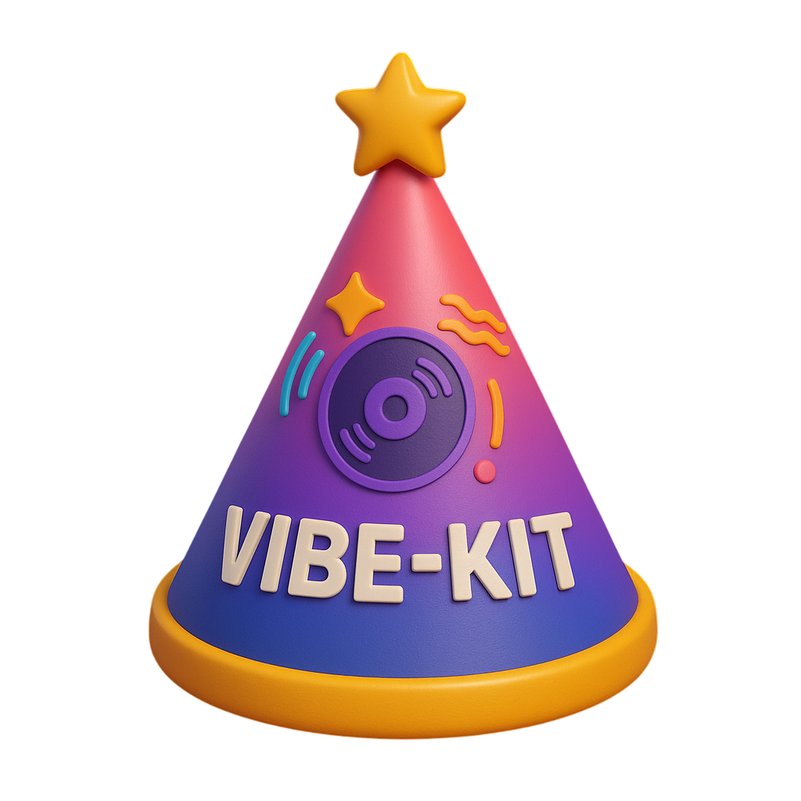

<div align="center">



# VibeKit

### Run OpenAI Codex and Anthropic Claude Agents privately

<p>


</p>
</div>

-----

<p align="center">
  <a href="#-example">Example</a> •
  <a href="#-supported-agents">Supported Agents</a> •
  <a href="#-configuration">Configuration</a> •
  <a href="https://discord.com/invite/mhmJUTjW4b" target="_blank">Discord</a> 
</p>

-----

## Example

```ts
import { VibeKit } from 'vibekit';

const vk = new VibeKit({
  agent: 'codex',
  config: {
    openaiApiKey: '...',
    githubToken: '...',
    repoUrl: 'https://github.com/user/repo',
    e2bApiKey: '...',
  },
});

// Regular usage (no streaming)
const result = await vibeKit.generateCode("Create a React component");

// Streaming usage (with callbacks)
const result = await vibeKit.generateCode("Create a React component", {
  onUpdate: (message) => console.log(message),
  onError: (error) => console.error(error)
});

// Create a Pull Request
// First generate code, then create a PR
await vibeKit.generateCode("Add error handling to the login function");

const prResult = await vibeKit.createPullRequest();

console.log(`PR created: ${prResult.html_url}`);
// Output: PR created: https://github.com/user/repo/pull/123

// The pull request will be automatically labeled 'codex' or 'claude' based on the agent used.
```

## Supported Agents

- [x] OpenAI Codex
- [x] Claude Code

## Configuration

```ts
export type AgentName = 'codex' | 'claude';

export type AgentConfig =
  | {
      agent: 'codex';
      config: {
        openaiApiKey: string;
        githubToken: string;
        repoUrl: string;
        e2bApiKey: string;
        e2bTemplateId?: string; // defaults to "super-codex"
        model?: string; // defaults to codex-mini
        sandboxId?: string; // if you want to resume an existing sandbox
      };
    }
  | {
      agent: 'claude';
      config: {
        anthropicApiKey: string;
        githubToken: string;
        repoUrl: string;
        e2bApiKey: string;
      };
    }
```

### Features

- **Automatic Branch Creation**: Creates a new branch with a descriptive name
- **Smart PR Metadata**: Uses AI to generate meaningful PR titles and descriptions
- **Commit Management**: Handles staging, committing, and pushing changes
- **GitHub Integration**: Creates the actual PR using GitHub's REST API
- **Agent Labeling**: Automatically labels pull requests with the agent name ('codex' or 'claude')

### Requirements

- Only available for the Codex agent
- Requires a valid GitHub token with repository access
- Repository must be accessible with the provided GitHub token

## Contributing

Contributions are welcome! Please open an issue or submit a pull request.

## License

This project is licensed under the MIT License. This means you are free to use, modify, and distribute the code, provided that you include the original license and copyright notice in any copies or substantial portions of the software. The software is provided "as is", without warranty of any kind, express or implied, including but not limited to the warranties of merchantability, fitness for a particular purpose, and noninfringement. For more details, please refer to the LICENSE file included in the repository.
