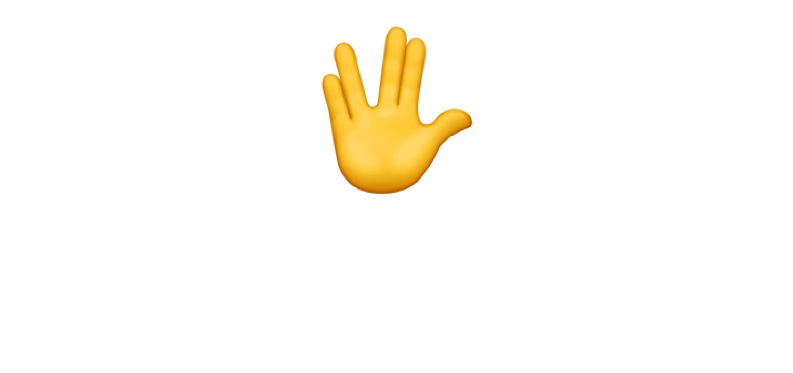

<div align="center">



### Run coding agents in a secure sandbox

A simple SDK for safely running Codex, Claude, Gemini CLI, and SST Opencode in your app or workflow.

---

[Website](https://vibekit.sh) • [Docs](https://docs.vibekit.sh) • [Discord](https://discord.com/invite/mhmJUTjW4b)

---
</div>

## 🧠 What is VibeKit?

VibeKit is an SDK for running powerful coding agents like **Claude Code**, **OpenAI Codex**, **Gemini CLI**, and **SST Opencode** in secure, customizable sandboxes. You can generate and execute real code safely, stream output to your UI, and run everything in the cloud — with full isolation and flexibility. Local execution coming soon.

One SDK. Any coding agent. Any sandbox.

## 🚀 Quick Start

```bash
npx @vibe-kit/sdk init
# or after global install
vibekit init
```

## 🔐 Authentication

### Claude OAuth Authentication (Recommended)

Authenticate with your Claude Pro/Max account for better rate limits.

> **Security Note**: OAuth tokens are stored locally at `~/.vibekit/claude-oauth-token.json` with restricted permissions (600). For production environments, consider using environment variables or a secrets manager.

```bash
# Authenticate with Claude
vibekit auth login claude

# Check authentication status
vibekit auth status        # Show all providers
vibekit auth status claude # Show specific provider

# Verify authentication with test API call
vibekit auth verify claude

# Export token for other instances
vibekit auth export claude              # Shows environment variable format
vibekit auth export claude --format json # JSON format
vibekit auth export claude --format full # Full token with refresh capability

# Import token on another instance
vibekit auth import claude --env                    # From environment variable
vibekit auth import claude --token "your-token"     # Direct token
vibekit auth import claude --file token.json        # From file

# Logout
vibekit auth logout claude
```

### Testing

```bash
# Run all tests
npm test

# Run OAuth-specific tests
npm test test/claude-oauth.test.ts
```

Once authenticated, you can use Claude without an API key:

```typescript
const vibeKit = new VibeKit()
  .withAgent({
    type: "claude",
    provider: "anthropic",
    // OAuth token will be used automatically
    model: "claude-sonnet-4-20250514",
  })
  .withSandbox(sandboxProvider);
```

### Using OAuth Token via Environment Variable

You can also provide the OAuth token directly via environment variable:

```bash
export CLAUDE_CODE_OAUTH_TOKEN="your-oauth-token"
```

Or pass it in your code:

```typescript
const vibeKit = new VibeKit()
  .withAgent({
    type: "claude",
    provider: "anthropic",
    oauthToken: process.env.MY_OAUTH_TOKEN,
    model: "claude-sonnet-4-20250514",
  })
  .withSandbox(sandboxProvider);
```

### Multi-Instance Usage

For using OAuth tokens across multiple instances (CI/CD, containers, etc.):

1. **Quick sharing**: Set `CLAUDE_CODE_OAUTH_TOKEN` environment variable
2. **With auto-refresh**: Copy `~/.vibekit/claude-oauth-token.json` between instances
3. **Production**: Use a secrets manager or API keys

See [OAuth Multi-Instance Guide](./docs/oauth-multi-instance.md) for detailed instructions.

### Library API Usage

You can also use OAuth authentication programmatically:

```typescript
import { ClaudeAuth } from '@vibe-kit/sdk';

// Authenticate and get token
const token = await ClaudeAuth.authenticate();

// Check if authenticated
const isAuthenticated = await ClaudeAuth.isAuthenticated();

// Get valid token (auto-refresh if needed)
const accessToken = await ClaudeAuth.getValidToken();

// Export token
const exportedToken = await ClaudeAuth.exportToken('full');

// Import token
await ClaudeAuth.importToken({ refreshToken: 'your-refresh-token' });

// Clear authentication
await ClaudeAuth.logout();
```

### Web OAuth Usage

For web applications, OAuth authentication works the same way as CLI - users copy and paste the authentication code:

```typescript
import { ClaudeWebAuth, MemoryTokenStorage } from '@vibe-kit/sdk/auth';

// Frontend - Generate OAuth URL
const { url, state, codeVerifier } = ClaudeWebAuth.createAuthorizationUrl();

// Store for later use
sessionStorage.setItem('oauth_state', state);
sessionStorage.setItem('oauth_code_verifier', codeVerifier);

// Open Claude authentication in new tab
window.open(url, '_blank');

// After user copies the authentication code (format: code#state)
const authCode = "paste-authentication-code-here";

// Backend - Authenticate with the code
const storage = new MemoryTokenStorage(sessionId);
const auth = new ClaudeWebAuth(storage);
await auth.authenticate(authCode, codeVerifier, state);

// Use the token
const accessToken = await auth.getValidToken();
```

See [Web OAuth Usage Guide](./docs/oauth-web-usage.md) for complete examples including React, Vue.js, and Express implementations.

## ⚡️ Features

🧠 Drop-in SDK for Claude Code, OpenAI Codex, Gemini CLI, and SST Opencode 
🔒 Secure sandboxing for safe code execution  
🌐 Cloud-based execution (local support coming soon)  
🔁 GitHub automation: branches, commits, PRs  
💬 Prompt history and context continuity  
📡 Streamed output for real-time UIs  
🔍 OpenTelemetry support for tracing and metrics  
🧰 Compatible with any sandbox runtime
⚡ Execute arbitrary commands in sandbox environments

## 📦 Supported Sandbox Runtimes

Currently supports E2B, Daytona, Northflank, Cloudflare and Dagger, with other providers coming soon.

## 🧪 Use Cases

Build internal debugging tools, ship AI-powered features, scaffold new ideas, automate repetitive coding tasks, and test LLM output safely in production or prototyping environments.

## 🤝 Contributing

Contributions welcome! Open an issue, start a discussion, or submit a pull request.

## 📄 License

MIT — see [LICENSE](./LICENSE) for details.

© 2025 Superagent Technologies Inc.
